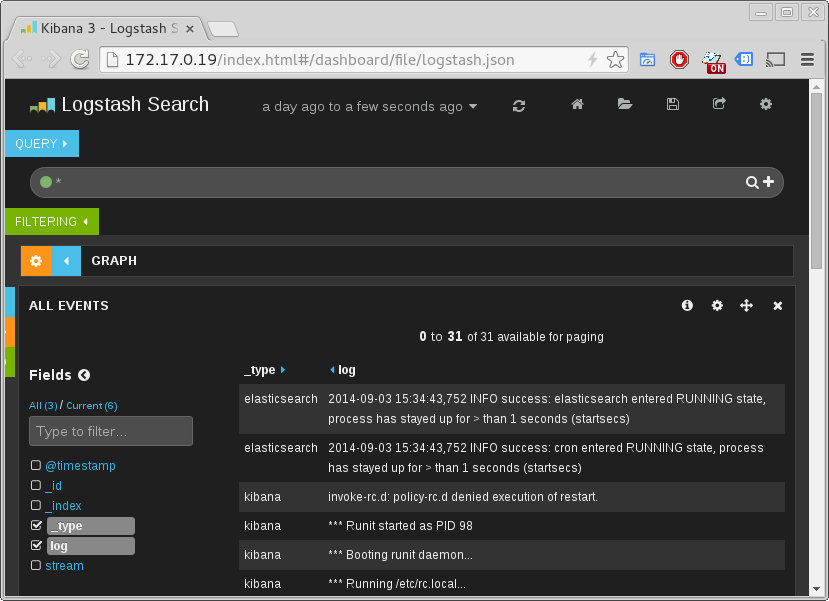

docker-log-collector
==============

A Docker container that collects the Docker logs of all running containers
using fluentd.  By default, it passes everything along to an ElasticSearch
container linked in as es1.


```
docker run -td \
           -v /var/run/docker.sock:/var/run/docker.sock \
           -v /var/lib/docker/containers:/var/lib/docker/containers \
           --link elasticsearch:es1 \
           --name collector bprodoehl/log-collector
```

This is based on the very excellent article at
http://jasonwilder.com/blog/2014/03/17/docker-log-management-using-fluentd/,
with a pile of real-world fixes added on top so that it all actually works, and time formats are properly parsed, and the logs can be read with Kibana, and so on.


Watch the logs from all your local containers with Kibana
===================

You can easily watch and analyze the logs from all of your containers by combining this container with Kibana.  As you can see in the screenshot below, each line of output from each locally-running container will show up in Kibana, with the ```_type``` field set to the container name and the ```log``` field containing the message.



This sample script will launch the containers necessary to watch the logs from all of your locally-running Docker containers, and will open Kibana in your default browser.

```bash
#!/bin/bash

### Pull the necessary containers
docker pull balsamiq/docker-elasticsearch
docker pull bprodoehl/kibana
docker pull bprodoehl/log-collector

### Launch them
# Launch ElasticSearch
docker run -itd --name elasticsearch --hostname elasticsearch balsamiq/docker-elasticsearch

# Launch Kibana
docker run -itd -e KIBANA_SECURE=false --link elasticsearch:es --name kibana --hostname kibana bprodoehl/kibana

# Launch the log collector
docker run -itd -v /var/run/docker.sock:/var/run/docker.sock -v /var/lib/docker/containers:/var/lib/docker/containers --link elasticsearch:es1 --name collector --hostname collector bprodoehl/log-collector

### Open up Kibana in your default browser
OPEN_CMD=open
for cmd in xdg-open gnome-open sensible-browser open;
do
    which $cmd &> /dev/null
    if [ 0 == $? ]; then
        OPEN_CMD=$cmd
        break
    fi
done  

echo Opening Kibana in default browser with $cmd
KIBANA_IP=`docker inspect --format '{{ .NetworkSettings.IPAddress }}' kibana`
$OPEN_CMD "http://$KIBANA_IP/index.html#/dashboard/file/logstash.json"
```
